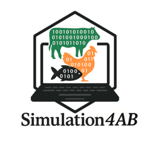
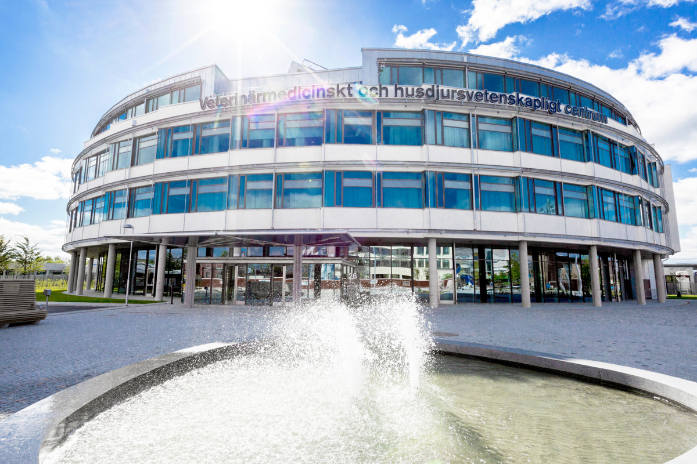
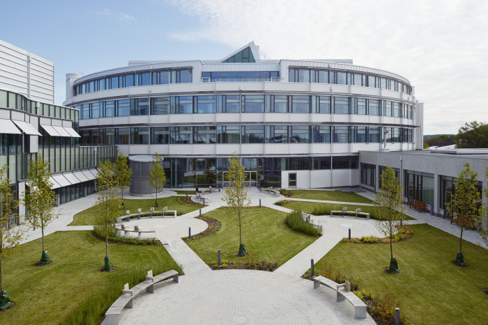

# Simulation for Animal Breeding

   

Simulation for Animal Breeding: Genetics, Biomarkers, and Disease transmission

The aim of this course is to **learn methodological approaches** to simulate phenotypic, genotypic, biomarkers and transmission data to validate scientific hypothesis. Students will learn how to simulate and analyse different types of data, ranging from production and performance traits to molecular and epidemiological data, within animal populations.

📅 **Course date**: 21–25 September and 1–2 October 2026.

📍 **Place**: Veterinärmedicinskt och husdjursvetenskapligt centrum ([VHC](https://internt.slu.se/en/support-services/campus-and-buildings/vhc/)), Uppsala (Sweden).

🔗 **Official course page**: [Simulation for Animal Breeeding at SLU](https://www.slu.se/en/study/programmes-courses/doctoral-education/research-schools/gs-vmas/courses/)
 

------------------------------------------------------------------------

## 👨‍🏫 Course leader

-   [Martin Johnsson](https://www.slu.se/en/profilepages/j/martin-johnsson/), SLU (MJ)

## 👩‍🏫 Teachers

-   [Hector Marina](https://www.slu.se/en/profilepages/m/hector-marina/), SLU (HM)
-   [Pablo Dominguez Castaño](https://www.slu.se/en/profilepages/c/pablo-dominguez/), SLU (PDC)

------------------------------------------------------------------------

## 📖 Program

The course consists of five whole-day meetings in Uppsala (Sweden), with the possibility of hybrid online participation (🪑 Onsite; 💻 Online), including lectures and computer exercises (21–22 September), followed by two fully online meetings (1–2 October).

### Day 1 🌞 (21 Sep; 🪑&💻)

-   Introduction to the infinite applications of simulations (MJ)

### Day 2 🌞 (22 Sep; 🪑&💻)

-   Simulating phenotypic data (PDC)

### Day 3 🌞 (23 Sep; 🪑&💻)

-   Breeding programs for different species (cattle, pigs, broilers and fish) (MJ, PDC, HM).

### Day 4 🌞 (24 Sep; 🪑&💻)

-   Simulating disease transmission (HM)

### Day 5 🌞 (25 Sep; 🪑&💻)

-   Simulating Biomarker and RNA-Seq data (HM) 
-   Power analysis and statistical power testing (MJ)

### Day 6 🍁 (1 Oct; 💻)

-   Individual project presentations (1/2)

### Day 7 🍁 (2 Oct; 💻)

-   Individual project presentations (2/2)

The course is **free of charge** and open to all career stages. PhD students at SLU will be prioritised. 
Students are expected to bring their own computers 💻 for practical exercises and project work.

------------------------------------------------------------------------

## 🤝 Contributing

Pull requests are welcome! Please make sure to update tests as appropriate.

------------------------------------------------------------------------

## 📜 License

This course material is licensed under [Sveriges lantbruksuniversitet](https://www.slu.se/)

------------------------------------------------------------------------
